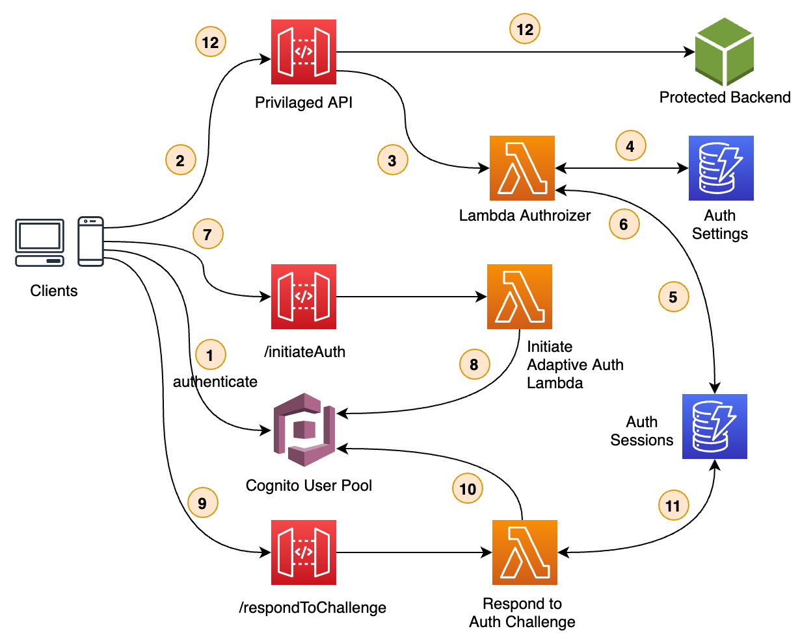
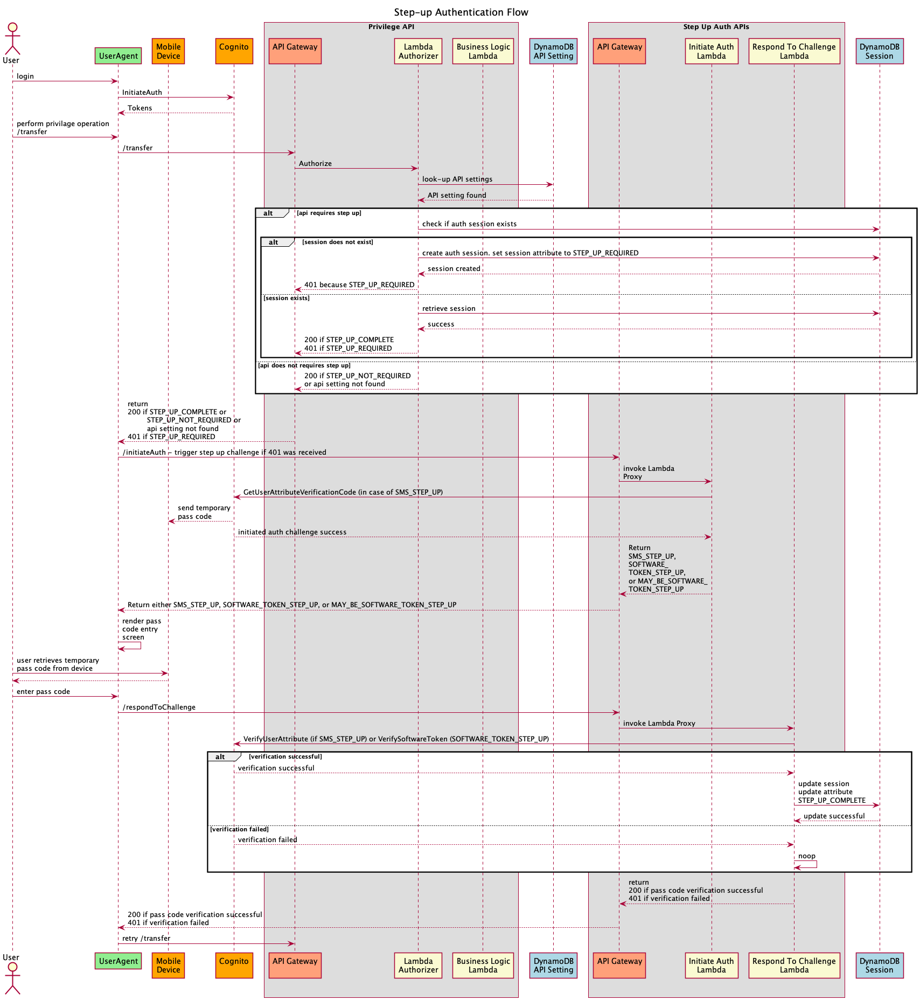
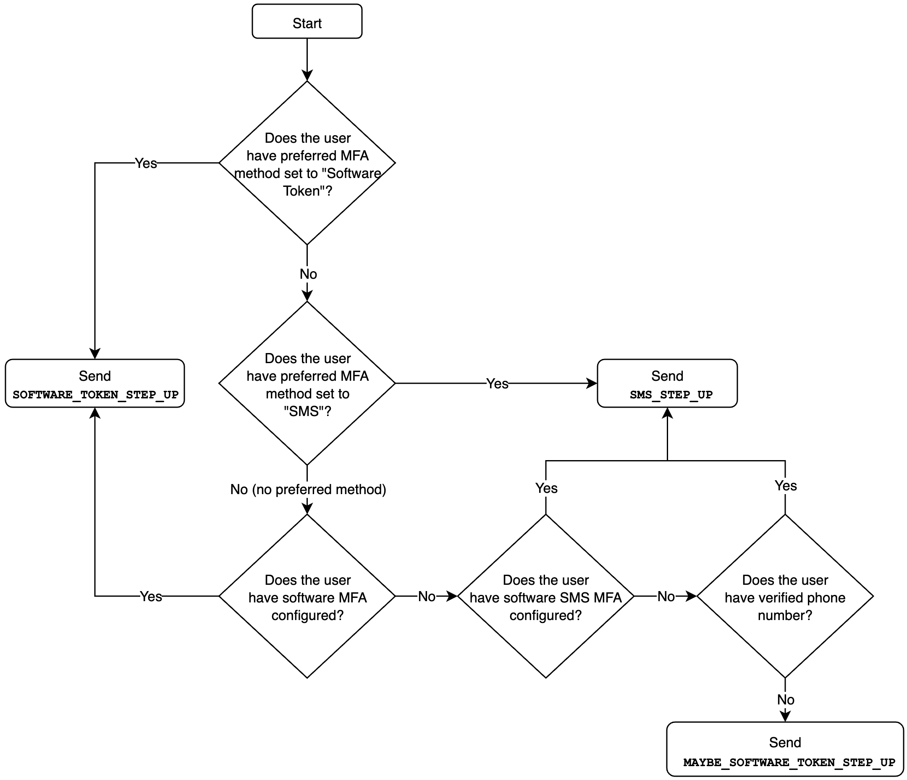
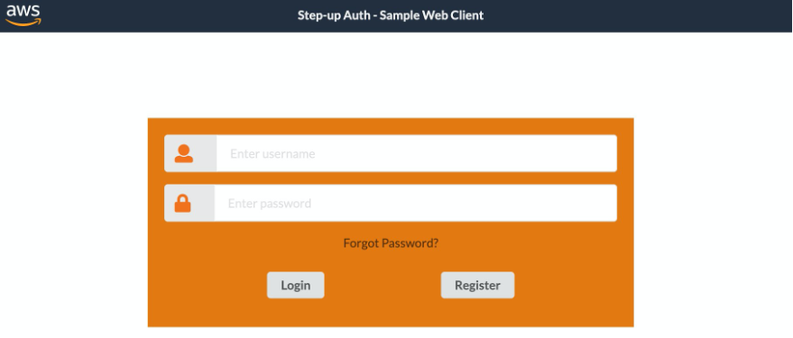
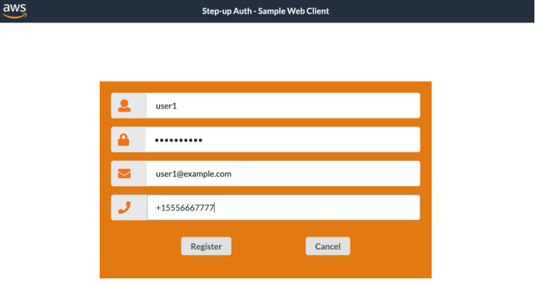
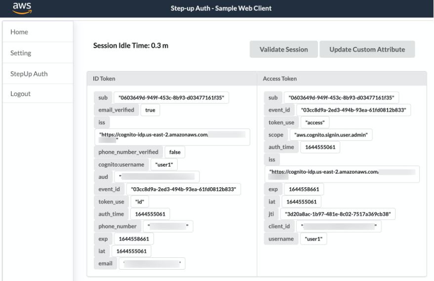
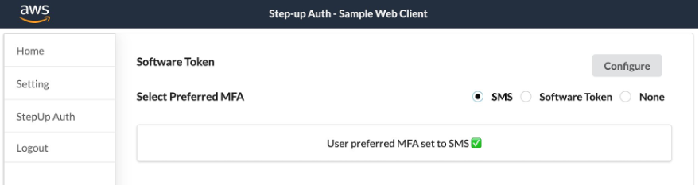
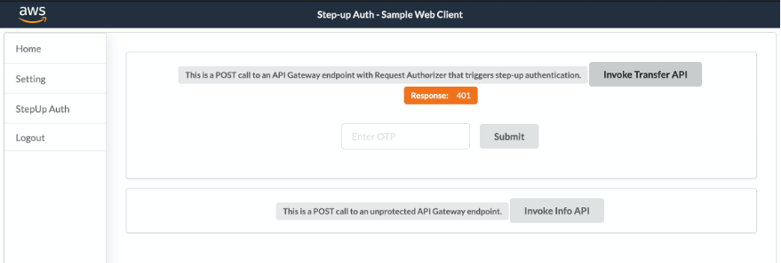
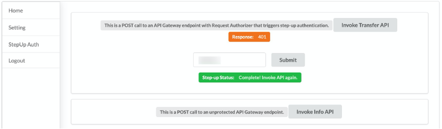
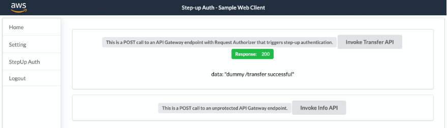

## How to implement Step-up Authentication using Amazon Cognito

This repository contains accompanying source code for the AWS Blog post, [How to implement Step-up Authentication using Amazon Cognito](#).

We will illustrate how to perform step-up authentication using Amazon API Gateway Lambda Authorizer, Lambda functions, Amazon Cognito and Amazon DynamoDB. Let us first review the architecture in next section.

## Prerequisites

Reference architecture discussed in this blog uses purpose-built Step-Up workflow engine, realized using custom SDK, which leverages Amazon DynamoDB service as persistent layer.  This workflow engine is generic and can be used across any API serving layers, e.g., Amazon API Gateway or Application Load Balancer (ALB), as long as the API serving layers can intercept API requests to perform additional actions.  The Step-Up workflow engine also relies on an identity provider capable of vending out OAuth 2.0 token, i.e., access token.  Therefore, there are three parts to the step-up solution.

1. API Serving Layer with capability to execute custom logic before executing business logic
2. OAuth 2.0 compliant Identity Provider system
3. Purpose-build Step-up Workflow engine

The solution discussed in this blog uses Amazon Cognito as the identity provider, Amazon API Gateway with Authorizer Lambda function to trigger the Step-up workflow engine and DynamoDB Service as persistent layer used by Step-up workflow Engine.  A reference implementation of Amazon API Gateway Authorizer Lambda function is provided in sample code.  Additionally, the purpose-build Step-up Workflow engine provides API’s, initiateAuth and respondToChallenge, realized using Amazon API Gateway and Lambda function, to drive the API invocation step-up state.

Note that if you decide to use API serving layer other than Amazon API Gateway, or use OAuth 2.0 identity provider besides Amazon Cognito, you will have to make changes to accompanying sample code.

## Architecture

The reference architecture is show below shows.



Let us traverse how user's API's request are handled by the solution, and how the user state is "elevated" by going through additional challenge before they can successfully invoke a privilege API.

Let us traverse how user's API's request are handled by the solution, and how the user state is "elevated" by going through additional challenge before they can successfully invoke a privilege API.

1. It is important to note that user must authenticate with Cognito initially.  As a result, they must have a valid access token generated by Cognito User Pool.
2. User then performs a privileged API invocation and passes access token in Authorization header.
3. The API is protected using a Lambda Authorizer and the invocation triggers Lambda Authorizer.  Authorizer first validates the token using Cognito User Pool public key.  If the token is invalid, a 401 response can be sent immediately prompting the client to present valid token.
4. Authorizer performs a look-up in DynamoDB setting table to check whether current request needs elevated privilege (or step-up privilege).  In setting table, you can define which API actions requires elevated privilege.  You can additionally bundle APIs into a group by defining the group attribute.  This allows you to further segregate privileged API's especially in a large-scale deployment.
5. If API request requires elevated privilege, Authorizer will check for an existing step-up session for this specific user in session table.  The key for this table will be the “JTI” of the access_token (which can be obtained after token verification).
6. If a valid session exists then authorization will be given, otherwise an un-authorized access response (401 HTTP code) will be sent back from lambda authorizer indicating that user requires elevated privilege.
7. Client app will initiate a step-up action by calling another API /initiate-auth. This action is protected by Cognito Authorizer and the client needs to pass valid access_token in the authorization header
8. The call will be forwarded to a lambda function that will initiate the step-up action with end-user. The function will first call Cognito API GetUser to find out user’s MFA settings. Depends on which MFA type is enabled for the user, the function will behave as below:
  a. If user doesn’t have MFA enabled but has a verified phone number, the function will trigger SMS_STEP_UP
  b. If user doesn’t have MFA enabled and no verified phone number then the function will return MAYBE_SOFTWARE_TOKEN_STEP_UP code (could be extended to allow step-up using verified email if one exists)
  c. If user has SMS_MFA enabled, then the function will call Cognito API GetUserAttributeVerificationCode to trigger SMS_STEP_UP to the user and respond to client app with “SMS_STEP_UP” to indicate that a code has been sent to user using SMS.
  d. If user has SOFTWARE_TOKEN_MFA enabled then the function will return SOFTWARE_TOKEN_STEP_UP without calling any Cognito APIs (since software token code will be obtained from an authenticator app).
9. Client app will present the UI to collect response to step-up challenge.  The app will call another API /respond-to-challenge; client will pass access_token in authorization header and step-up challenge type together with the response provided by the user tp step-up challenge in the request body. This endpoint is protected by Cognito Authorizer.
10. The call will be forwarded to lambda function that will verify the response with Cognito using VerifyUserAttribute API (in case of SMA_STEP_UP) or VerifySoftwareToken API (in case of SOFTWARE_TOKEN_STEP_UP) depends on the type of step-up action that was returned from /initiate-auth API. Cognito response will indicate whether verification was successful.
11. If Cognito response in previous step was successful, the lambda function associated with /respond-to-challenge API will insert a record in session table using the access_token JTI as key.  This record will indicate that the user has completed step-up authentication. The record will be inserted with a TTL equals to the lesser of the remaining period in access_token timeout or default TTL value set in lambda function as configurable environment variable, SESSION_TABLE_ITEM_TTL.  Ideally, for a step-up session, TTL value should be less than the access_token expiry time.
12. Client app can re-try the original call to the protected API and this call should now succeed since an active step-up session exists for the user. Calls to other protected APIs that require step-up should also succeed as long as the step-up session hasn’t expired.

These sequences are better illustrated in the sequence diagram below.



## Implementation details

Now let’s talk about the components that make up the step-up auth.

### Step-up authentication data design

Step-up authentication solution relies on two tables, a `session` table and a `setting` table.  The session table contains user's step-up session information where as `setting` table contains an API step-up configuration.  API Gateway Authorizer (discussed in next section), checks `setting` table to determine if API request requires step-up session.  The authorizer creates and updates entries in `session` table depending on whether an API requires step-up session or if step-up session is completed.

A sample record in this table is given below.  Let's go through each attribute:

- sessionId represents the jti claim of user's access token.  A user initiates step-up auth using an access_token that they received from Cognito /token endpoint.  sessionId is the primary key for the table.
- clientId is user's client id present in access_token
- token is an optional field where we can actually store a hashed version of access_token.  By default, however, this field is set to the same value as sessionId
- referrerUrl is the API endpoint that trigger the step-up authentication
- stepUpStatus indicates user's current step-up authentication state
  - STEP_UP_REQUIRED value represents that this user session must provide additional authentication (step-up)
  - STEP_UP_COMPLETED shows that user has gone through the additional authentication challenges and completed step-up authentication flow
  - STEP_UP_ERROR indicates that an error occurred during step-up authentication flow.  This could be caused by user repeatedly failing to complete the additional authentication challenges, or a Cognito error. 
- userId is extracted from access_token and stored in the table for reference
- createTimestamp represents when this item was created
- lastUpdateTimestamp represents when this session item was last updated.
- ttl indicates when this item will be automatically deleted from this table by DynamoDB service.  Note that the default TTL value is 24 hours (or 86400 seconds).  This value can be overridden using an environment variable SESSION_TABLE_ITEM_TTL set on Authorizer lambda.


```json
{
 "sessionId": "81984146-9a13-473d-a1d0-11da4d194718",
 "clientId": "5ak6q222n2m5rn52akhp81vm59",
 "token": "81984146-9a13-473d-a1d0-11da4d194718",
 "stepUpStatus": "STEP_UP_REQUIRED",
 "userId": "smoghal",
 "referrerUrl": "https://0k7tb69r3l.execute-api.us-east-2.amazonaws.com/dev/transfer",
 "createTimestamp": "2021-09-19T04:42:39.486Z",
 "lastUpdateTimestamp": "2021-09-19T04:42:39.486Z",
 "ttl": 1632112959
}
```

Next, let us look at the setting table.  Each entry in this table correlate to an API configuration indicating whether a step-up authentication is required.  Two sample API values are shown below to.

- id is the primary key for setting table.  It represents an api path.  Referring to API Gateway, an API path is present in API Gateway Lambda Proxy Integration Event as path attribute.  It doesn't contain API stage.
•	stepUpState indicates API’s step-up authentication requirement state
  - STEP_UP_NOT_REQUIRED value indicates no additional authentication is needed for this API.
  - STEP_UP_REQUIRED value indicates that invocation of this API requires additional authentication steps.
  - STEP_UP_DENY value disables any API invocations.  Lambda authorizer returns 403 forbidden error code to the caller.
•	createTimestamp represents when this item was created
•	lastUpdateTimestamp represents when this session item was last updated.


```json
{
 "id": "/info",
 "lastUpdateTimestamp": "2021-08-23T08:25:29.023Z",
 "stepUpState": "STEP_UP_NOT_REQUIRED",
 "createTimestamp": "2021-08-23T08:25:29.023Z"
},
{
 "id": "/transfer",
 "lastUpdateTimestamp": "2021-08-23T08:22:12.436Z",
 "stepUpState": "STEP_UP_REQUIRED",
 "createTimestamp": "2021-08-23T08:22:12.436Z"
}
```

### Authorizer

API Gateway Authorizer is a `REQUEST` type authorizer.  It protects privileged APIs that require step-up session.

Request authorizer ensures that API request contains a valid access token in HTTP Authorization header.  Using access token's JTI claim as key, it then attempts to retrieve a step-up `session` from `sessions` table.  If a session exists and `stepUpStatus` field is set to either `STEP_UP_COMPLETED` or `STEP_UP_NOT_REQUIRED`, authorizer lets the API call through by generating an `allow` [API Gateway Authorizer Policy](https://docs.aws.amazon.com/apigateway/latest/developerguide/apigateway-resource-policies.html).  If `stepUpStatus` is set to `STEP_UP_REQUIRED`, authorizer returns 401 challenge to the caller.

If a step-up `session` does not exists in `sessions` for the incoming API request, authorizer will attempt to create a session.  It first look up the `settings` table for API configuration.  If a configuration is found and the `stepUpStatus` field in `settings` table is set to `STEP_UP_REQUIRED`, it indicates that user must provide additional authentication in order to call this api.  In this case, authorizer will create a new `session` in `sessions` table using access token's JTI claim as session key; it will return a 401 challenge to the caller.  If API configuration in settings table is set to `STEP_UP_DENY`, authorizer will return `deny` [API Gateway Authorizer Policy](https://docs.aws.amazon.com/apigateway/latest/developerguide/apigateway-resource-policies.html) hence blocking the API invocation; caller will see a 403 forbidden error.

Authorizer uses purpose build `auth-sdk` code to interface with both `sessions` and `settings` DynamoDB tables.  `auth-sdk` stream-lines CRUD operations on tables by providing convenience methods to create/update/delete items in tables.  Under the hood, `auth-sdk` uses [DynamoDB v3 client sdk](https://docs.aws.amazon.com/AWSJavaScriptSDK/v3/latest/clients/client-dynamodb/index.html).

### Initiate Endpoint

The initiate endpoint is called by the frontend after the API Gateway returns a 401 response asking caller for an additional challenge, starting the step-up flow. The role of the initiate endpoint is simply to determine what method of multi-factor authentication the user prefers (either software token or SMS MFA), return that data to the client, and (if the user prefers SMS MFA), send a SMS with a code to the user. If the user prefers software token MFA, sending a code to the user isn’t necessary, since software token code generation is handled by the software token itself rather than Cognito.

The initiate endpoint checks several preferences (provided by the Cognito [GetUser](https://docs.aws.amazon.com/cognito-user-identity-pools/latest/APIReference/API_GetUser.html) API action) to determine whether the user prefers software token or SMS MFA, including the user’s preferred MFA setting, their list of enabled MFA methods, and whether or not they have a verified phone number. See the below flowchart for the full decision logic.



The initiate endpoint does not require any extra parameters, it only requires the Cognito access token to be passed in the Authorization header of the request. It uses the access token to call the Cognito [GetUser](https://docs.aws.amazon.com/cognito-user-identity-pools/latest/APIReference/API_GetUser.html) and [GetUserAttributeVerificationCode](https://docs.aws.amazon.com/cognito-user-identity-pools/latest/APIReference/API_GetUserAttributeVerificationCode.html) API actions on behalf of the user.

Finally, once the initiate endpoint has determined the proper MFA method to use and (if applicable), it returns the MFA method to the frontend so that the frontend can display the correct content to the user. There are three possible options: MAYBE_SOFTWARE_TOKEN_STEP_UP, which is used when the MFA method cannot be determined, SOFTWARE_TOKEN_STEP_UP, which is used when the user prefers software token MFA, and SMS_STEP_UP, is used when the user prefers SMS MFA.

### Respond to Challenge Endpoint

Like the initiate endpoint, respond to challenge endpoint is called by the front-end once it receives an appropriate MFA method from initiate endpoint.  The user must respond to the challenge appropriately by invoking respond to challenge endpoint with a code and MFA method.  

Respond to challenge endpoint receives two parameters in POST body, one indicating the MFA method and the other containing the challenge response.  Additionally, this endpoint requires the Cognito access token to be passed in the Authorization header of the request.

If the MFA method is `SMS_STEP_UP`, this endpoint will invoke Cognito [VerifyUserAttribute](https://docs.aws.amazon.com/cognito-user-identity-pools/latest/APIReference/API_VerifyUserAttribute.html) command to verify user provided challenge response, i.e. SMS code.

If the MFA method is `SOFTWARE_TOKEN_STEP_UP` or `MAYBE_SOFTWARE_TOKEN_STEP_UP`, respond to challenge endpoint will invoke Cognito [VerifySoftwareToken](https://docs.aws.amazon.com/cognito-user-identity-pools/latest/APIReference/API_VerifySoftwareToken.html) command to verify challenge response sent in endpoint payload.

Once the user provided challenge response is verified above, respond to challenge endpoint will update the `sessions` table.  Using the access token JTI, it will mark `stepUpStatus` field to `STEP_UP_COMPLETED`.  If the challenge response verification step fails, no changes are made to `sessions` table.  API session stays in `sessions` table until TTL time expires when DynamoDB service will automatically expunge the item.

### Deployment

This solution can be deployed using CDK and it will create a working reference implementation that you can use for demonstration and learning purposes.  There are a few prerequisites to deployment.

1. Install [node](https://nodejs.org/en/) and npm in your environment.  You can use a [package manager](https://nodejs.org/en/download/package-manager/#macos) for your platform to install these.
2. Install [CDK](https://docs.aws.amazon.com/cdk/v2/guide/getting_started.html) guidelines for your environment.
3. Optionally, install [AWS CLI](https://docs.aws.amazon.com/cli/latest/userguide/getting-started-install.html)

CDK will create several resources in your account as below:

- Amazon Cognito User pool that is used as user registry
- API Gateway API containing three resources,
  - a protected resource that requires step-up authentication
  - initiate-auth resource to trigger the step-up challenge response
  - respond-to-challenge resource to complete step-up challenge
- Lambda authorizer that is used to protect APIs
- DynamoDB tables
  - `settings` table that holds configuration mapping of the APIs that require elevated privileges
  - `sessions` table that holds temporary, user-initiate step-up sessions and their current status.
- A React WebUI that demonstrates how to invoke a privileged API and go through step-up authentication.

Prior to deploying the solution, build the necessary resources first.  Use the accompanying `build.sh` script in `deployment folder.  Simply trigger the build script from a terminal window as follows:

```sh
cd deployment && ./build.sh
```

Now let us deploy the solution using `deploy.sh` script present in the `deployment` folder.  Set the required environment variables first:

```sh
export AWS_REGION=us-east-1
export AWS_ACCOUNT=<your account number>
export AWS_PROFILE=<valid profile in .aws/credentials that contains secret/access key to your account>
export NODE_ENV=development
export ENV_PREFIX=dev
```

`AWS_ACCOUNT` is used to bootstrap CDK deployment.  You must have AWS credentials files containing a profile with your account secret key and access key in order to do the deployment; set `AWS_PROFILE` to point to you profile.  Ensure that your account has enough privileges to create/update/delete following resources:

- Amazon Cognito
- Amazon API Gateway API and resources
- Amazon S3 Bucket
- AWS CloudFront distribution
- Amazon DynamoDB tables
- AWS Lambda functions
- IAM Roles

`NODE_ENV` can be set to `development` or `production`.  It controls the log output that Lambda functions generates.  And `ENV_PREFIX` allows you to prefix all resources with an tag; this enables a multi-tenant deployment of this solution.

Finally, trigger the stack deploying:

```sh
cd deployment && ./deploy.sh
```

The output from the command will contain a CloudFront distribution URL.  Use this URL to load the sample web app.

< screenshot >

### Testing Step-up Solution

Log into your AWS account and go to DynamoDB service console.  Locate the step-up-auth-setting* table.  Ensure this table contains following two items.  Create these items using DynamoDB service console if necessary.  We want the sample /transfer API to challenge user for additional authentication.  Sample /info API will not require additional challenge.

{
 "id": "/info",
 "lastUpdateTimestamp": "2021-08-23T08:25:29.023Z",
 "stepUpState": "STEP_UP_NOT_REQUIRED",
 "createTimestamp": "2021-08-23T08:25:29.023Z"
},
{
 "id": "/transfer",
 "lastUpdateTimestamp": "2021-08-23T08:22:12.436Z",
 "stepUpState": "STEP_UP_REQUIRED",
 "createTimestamp": "2021-08-23T08:22:12.436Z"
}

Launch your web browser and to load the CloudFront URL.  You will be presented with a login screen.



Register a new user.  Make sure that the email address and phone numbers are valid.  Upon clicking Register button, you will be prompted to enter verification code.  Check your email for the verification code.



You will be sent back to the login screen.  Login in with the user that you just registered.  You will see the welcome screen.



Go into Setting menu and select SMS as Preferred MFA.



Now, go into StepUp Auth menu and invoke Transfer API.  You should see a 401 challenge response.  At the same time, you should receive a one-time-password (OTP) on your device from Cognito.  



Use that OTP and fill “Enter OTP” field.  Hit the submit button.  This sends the OTP to respond-to-challenge endpoint.  Once OTP is verified, the endpoint will return a success or failure.  



If the verification passes, you can reinvoke the transfer API by hitting  Invoke Transfer API button.



Congratulations!  You’ve successfully performed a step-up authentication.

Experiment with the sample web application and setup Software Token under Setting menu.  Software Token requires that you must have Google Authenticator , or alike application on your mobile device.  When prompted for a OTP code when calling the privileged API (sample /transfer API), use the temporary code from the software token application.

## Additional considerations

This solution uses several Cognito APIs to provide step-up authentication functionality as described. Amazon Cognito applies rate limiting on all API categories (https://docs.aws.amazon.com/cognito/latest/developerguide/limits.html#category_operations) and rapid calls that exceed the assigned quota will be throttled.

Step-up flow for a single user may include multiple API calls like GetUser, GetUserAttributeVerificationCode, VerifyUserAttribute and VerifySoftwareToken. These APIs have different rate limits, the effective rate limit / requests per second (RPS) that your privileged and protected API can achieve will be equivalent to the lowest category rate limit among these APIs. Using the default quota, your application can achieve *25 SMS_STEP_UP RPS* or up to *50 SOFTWARE_TOKEN_STEP_UP RPS*.

## Conclusion

In this blog post, you saw how to implement step-up or step-up authentication for privileged APIs.  The solution uses Amazon Cognito User Pools for user management.
## Security

See [CONTRIBUTING](CONTRIBUTING.md#security-issue-notifications) for more information.

## License

This library is licensed under the MIT-0 License. See the LICENSE file.

